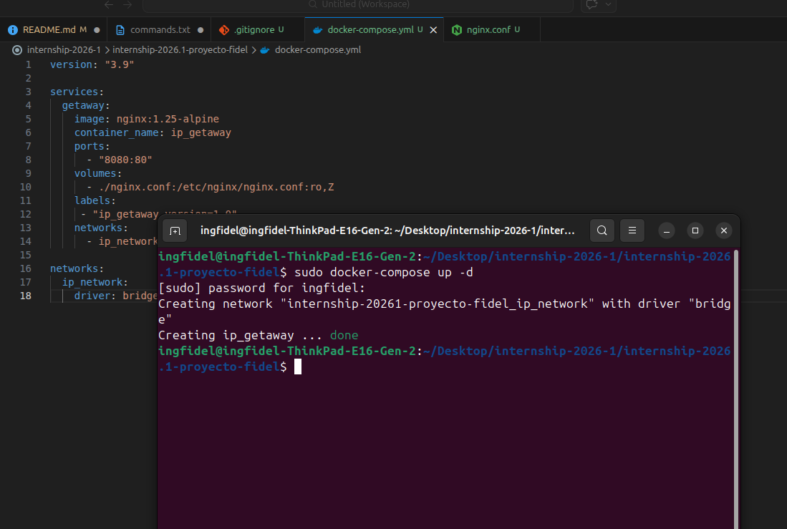
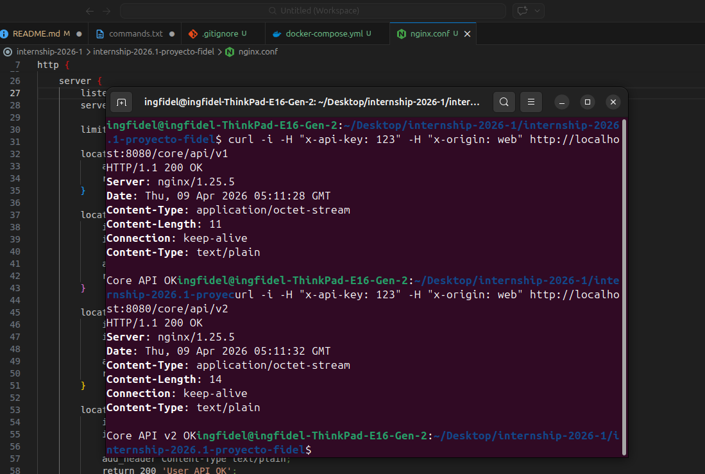
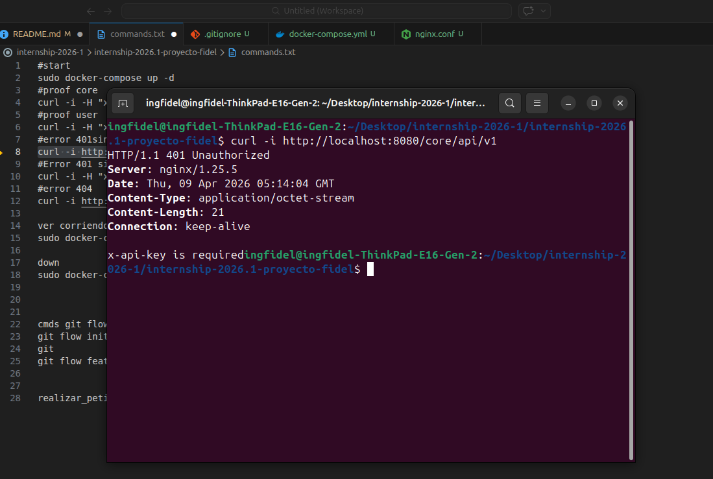
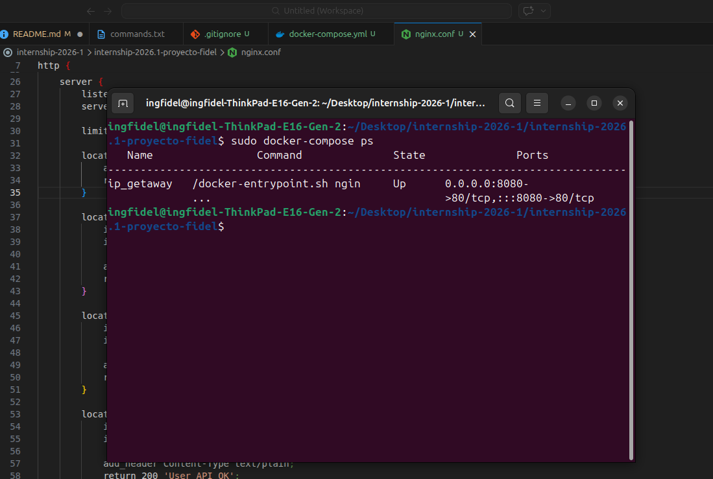
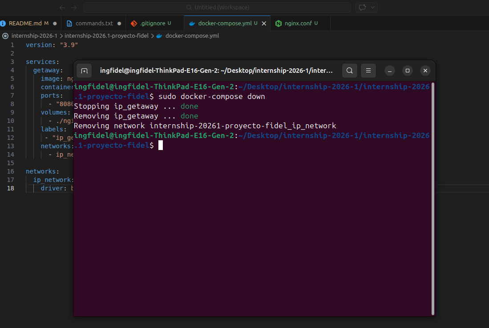
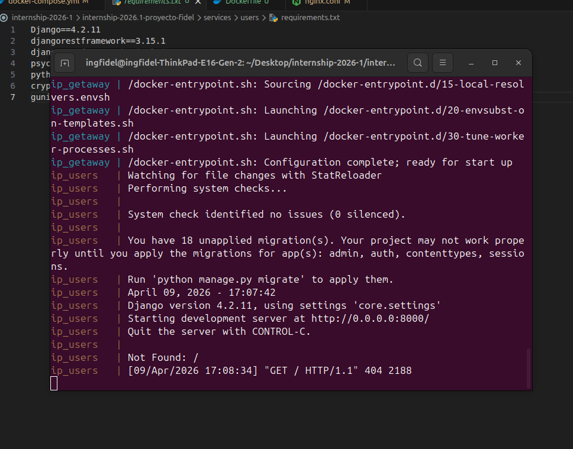
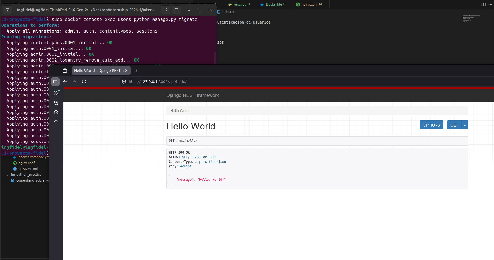
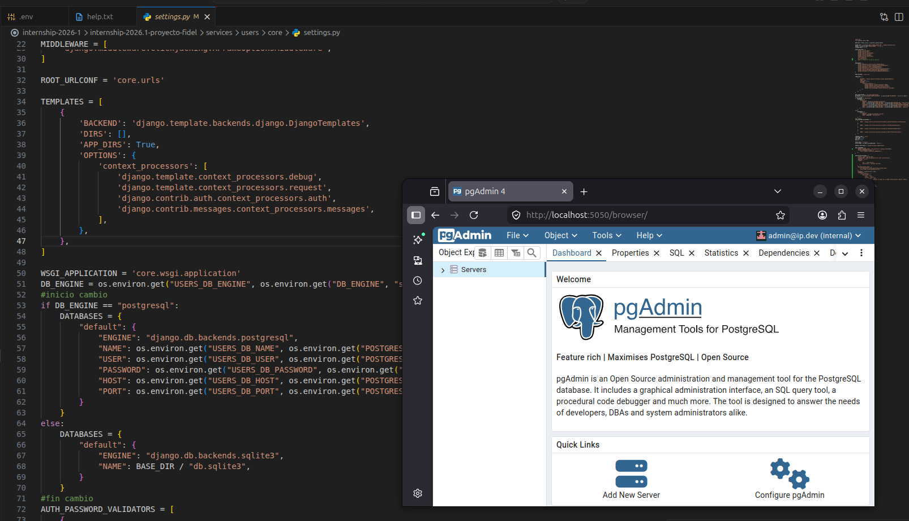
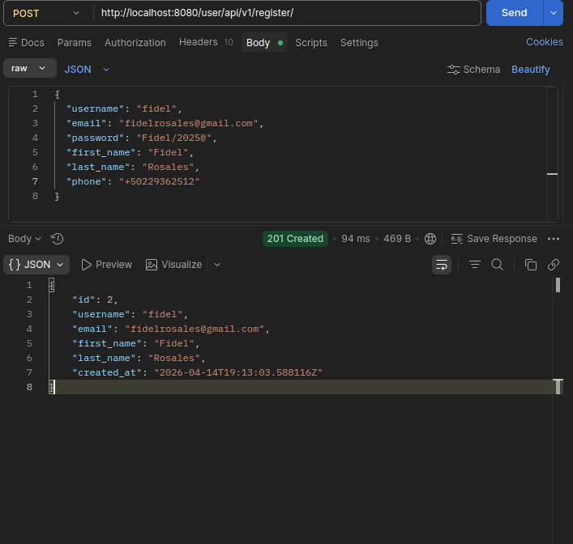
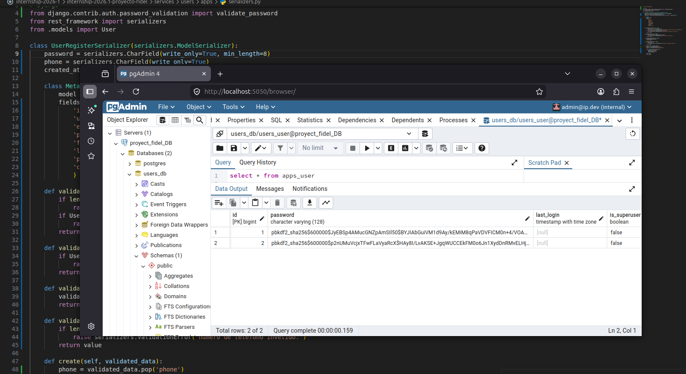

# internship-2026.1-proyecto-fidel
proyecto de pasantia internship-2026-1

# IP-002 - Implementación de API Gateway con Nginx

1. inicar servicios definidos en docker-compse

2. hace una peticion HTTP a mi archivo nginx.conf local

3. error 401 unauthorized falla ya que envia la peticion sin los headers obligatorios

4. muestra el estado del contenedor

4. detiene el contenedor y lo desmonta

# IP-003 Registro y Autenticación de Usuarios
# sub-issues Servicio Django con django rest framework

1. construir la imagen del servicio 

2. respuesta del status 200 ok 

# sub-issues Configuracion de base de datos y Cliente para base datos
 

# sub-issues Servicio para registrar un usuario

